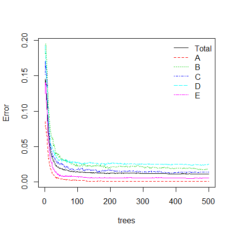
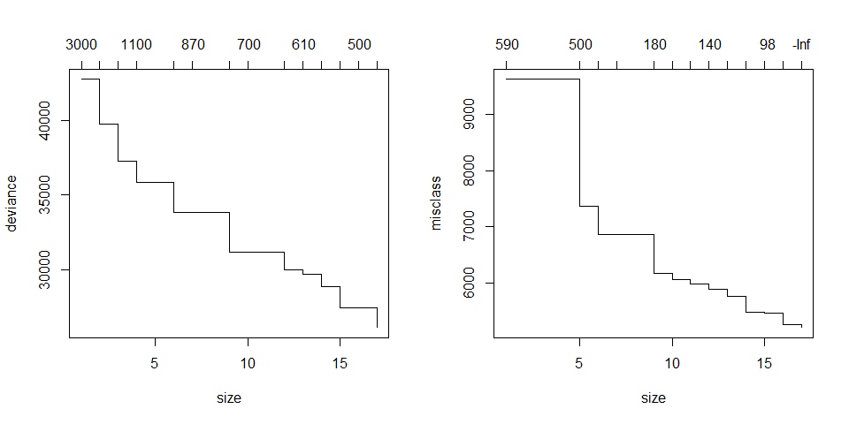

# Human Activity Recognition
Coursera Student  

## Synopsis

Personal activity data collected during weight training exercises was used
to develop a classification model within the `R` statistics program.
The model obtained determines which of five techniques was used to carry out
a particular weight training exercise.
The model was 99.8% accurate, with estimated out of sample errors of around 0.8%.

## Introduction

There are many personal electronic devices available now which can collect data
about personal activity in an easy and inexpensive manner.
Usually, people look at how much of a particular activity they do;
this study aims to look at how well they do it in the context of weight training
exercises.
The main project, detailed in the Appendix, collected data from six individuals
as they carried out dumbell exercises using five different techniques.
One technique was correct; the other four techniques were incorrect, carried
out in a controlled and supervised manner to ensure that no injury resulted.

This report is an overview of analyses carried out using the `R` statistics
program. The analyses develop a classification model which can use the raw data
collected from similar devices during similar exercises in order to ascertain
which of the five techniques were used to carry out each exercise.
The preprocessing steps required for the supplied training data will first be
outlined followed by initial and then more in depth analyses.
An estimate of expected out of sample errors for unseen data will also be given.
Full details of the analyses are given in the Appendix.

## Data Processing


The training data file, as supplied, contained more than simply the predictor
variables of interest and the classification of the exercise being carried out.
Specifically, it also included variables to identify the individual, various
timestamp variables, 'window' variables used in previous summary analyses,
and initial summary data from those analyses.
As such, several steps were required to remove the non-predictor variables and
the summary data from the data set, both in terms of the extra variables which
were included, and the extra summary records.


Once this initial processing had been carried out, as detailed in the Appendix,
the original data set of 160 variables and 19622 observations was reduced to
53 variables and 19216 observations.

The variable list was reduced further by looking at correlations between the
remaining predictor variables and removing those with the highest correlations.
This reduced the number of predictor variables down to the final 30 used in
all subsequent analyses.
This data set is refered to in this report as the raw data set.


To develop the classification model, first a simple model was used to
investigate the predictor variables, then cross-validation techniques were
used in a more complex random forest model.
Cross validation is used to check that any model obtained does not over fit
the training data set. If the training data set has been over fitted then the
accuracy obtained for the testing data set will be much less than the accuracy
obtained for the training data set.
In addition, K-fold cross validation improves accuracy by providing K models
which can be combined to provide a more accurate average model.
Although the K-fold methodology is incorporated intrinsically within most of
the techniques used here, standard cross validation was also used to verify
that the K-fold cross validation was behaving as expected.
So, for all of the techniques used here, a training data set was required on
which to develop the model, plus a separate testing data set was required on
which to test the model.
To this end, the raw data set was split into a training data set, which
contained 70% of the observations, and a testing data set, which contained
the remaining 30% of the observations.


### An Initial Tree Model

The first model obtained from the training data set was a simple tree model
with no intrinsic cross validation. The model obtained is illustrated in
Figure A.3 of the Appendix, and is repeated here in Figure 1 to indicate the
complexity required to carry out the classification for this data.


 

> Figure 1: A simple tree classification model results in a tree
which uses 8 of the 30 predictor variables included in the model.

Despite its visual complexity, this model is only 61.7% accurate giving an 
error rate of 38.3%.

The `tree` package used for the model can include K-fold cross validation
to see how the performance of the model depends on the size of the tree,
though for this model, pruning would appear to be of little benefit, as
illustrated in the Appendix.


Cross validation was also carried out by applying the model to the test data.
This gave a similar, though slightly lower, accuracy of 59.7% and hence an
out of sample error for the model of 40.3%. The slightly lower accuracy suggests
that some over fitting is occurring within the model.


### A Random Forest approach

Although the simple tree model obtained and illustrated above was complex, the
binary recursive partitioning used within the algorithm tends to allow models
to get 'stuck' rather than finding the best model.
A different approach which enables many more models to be sampled is likely to
produce a model with greater accuracy and better predictive power.

One such method found to be particularly successful is the random forest method.
This generates trees at random in order to sample many more trees and to
avoid the tree getting stuck in a non-optimum configuration.
It is also unlikely to produce a model which over-fits the training data.

The `caret` package is used as a wrapper around the `RandomForest` package
within `R`.
This enables cross validation to be included inherently within the `R` call
rather than needing to be setup and carried out explicitly.
In addition, the `doParallel` package
can be used to allow `R` to use all of the computer's resources rather than just
one computation thread (core), since calls through the `caret` package tend to
be much more time consuming than calls to the underlying routines.
Subsequent models were all carried out through `caret` using an `rf`
(random forest) model with `repeatedcv` K-fold cross validation (10 folds) and
5 repeats. The choice of 10 for the number of folds is the default for cross
validation within this method. The choice of 5 for the number of repeats is a
balance between increasing accuracy with a larger number of repeats, and not
increasing the time taken for the model to run to an unmanageable period.
Since the minimum reasonable number of repeats would be 3, 5 is chosen as a good
compromise.


Model training is rather time consuming within `caret`, so a small (5%)
subset of the training data is first used to examine the behaviour of the model.
The single tuning parameter used within the model determines the number of
random predictor variables considered at each split in the tree.
This parameter is tuned using the small subset of training data before using
the model on the much larger training data set.
Figure 2 shows the effect of the model tuning parameter on the accuracy of the
model, and Figure 3 shows the convergence of errors with the number of trees
in the forest sampled for the models.

 

> Figure 2: Effect of the tuning parameter `mtry` on the model accuracy
for models based on the training set (70% of the full data set).

 

> Figure 3: Convergence of out of sample errors with the number of trees
generated for models based on the training set (70% of the full data set).

Although there are 30 predictor variables within the data, accurate models are
obtained by considering only a small number of these variables at each split in
the tree.
In addition, the random forest method shows good convergence of errors with a
moderate number of trees.
The model could be speeded up by considering a maximum number of trees,
however, this option was not investigated here as it was not available from
the `caret` call using `rf`.

Accuracy and out of sample errors were obtained for the training data set,
and for the model from the training data applied to the test data set:


  Data Set|\ | Accuracy %|\ | Out of Sample Error %
---------:|--|----------:|--|---------------------:
 Training |\ |     98.7  |\ |                 1.3
  Testing |\ |     98.8  |\ |                 1.2

The model has a very high accuracy. This can often be the result of over-fitting
the model to the training data. However, when applied to the separate testing
data set, similar values for accuracy and out of sample errors are obtained.
This suggests that the model is not over fitting the data.
As such, the same technique is used to produce a final model based on all of the
supplied data, the raw data set, not just the 70% training data set.


```r
# the full model using the previously tuned grid and training controls
rw_model <- train(classe~., raw_data, method='rf', 
               trControl=tr_ctrl, tuneGrid = tr_Grid)
```


This final model, based on the full raw data set, has an accuracy of 99.2% and
hence an error rate of 0.8%.
Since the errors obtained above when using the training model to predict the
classification of the 30% testing data set are similar to those obtained by the
model when used to predict against the 70% training data set, it can be assumed
that the out of sample errors which we would get from this final model should be
around 0.8%, the same as obtained from this model when used to predict against
the full raw data set.
This will be the model used for predicting against unseen data.


Although the random forest method, as used here, does not provide a tree as
for the model depicted in Figure 1, it is possible to see which variables
are important in the final model. Figure A.7 in the Appendix shows the top
20 variables, the top 10 are shown in Figure 4.


 

> Figure 4: Variable Importance for the 10 most important variables in the
model based on the full data set.

### Conclusion

A classification model can be developed which allows techniques used to perform
weightlifting exercises to be classified, based on data collected from personal
activity monitors.
The final model obtained here from the training data supplied should be able to
classify unseen data with an accuracy of around 99.2%, which corresponds to
out of sample errors of around 0.8%.
To be of greater use, however, the methodology should be developed further to
use the underlying `RandomForest` analysis directly, which should be much faster
than using it through the wrapper `caret` package.


\newpage

## Appendix

### Exploring the data and preprocessing

The full data set and details of the project which collected the data are
available on the project website
[groupware.les.inf.puc-rio.br/har](http://groupware.les.inf.puc-rio.br/har).
Details of the preprocessing analysis and summary data included in the data set
are given in the [paper](http://groupware.les.inf.puc-rio.br/public/papers/2013.Velloso.QAR-WLE.pdf)
which accompanies the website:

> Velloso, E.; Bulling, A.; Gellersen, H.; Ugulino, W.; Fuks, H. 
[Qualitative Activity Recognition of Weight Lifting Exercises](http://groupware.les.inf.puc-rio.br/work.jsf?p1=11201).
Proceedings of 4th International Conference in Cooperation with SIGCHI
(Augmented Human '13) . Stuttgart, Germany: ACM SIGCHI, 2013.

A subset of this data, supplied for this analysis, is available 
[here](https://d396qusza40orc.cloudfront.net/predmachlearn/pml-training.csv).
This has been downloaded and saved so that it can be read in from the
working directory.

Read data in from the .csv file:


```r
all_data <- read.csv("pml-training.csv",na.strings=c("NA",""))
n_obs <- nrow(all_data)
n_vars <- ncol(all_data)
```

The data file contains the original, raw data and summary data, as illustrated
in Figure A.1, where white areas indicate an absence of data and grey areas
indicate where data is present.


```r
dpar <- par(mfrow=c(1,2),xpd=NA)
image(t(is.na(all_data)), axes=FALSE,
      xlab="Variable", ylab="Observation", col=c("darkgrey",NA))
at_vars <- c(1,seq(20,n_vars-1,by=20),n_vars)
axis(1, at=(at_vars-0.5)/n_vars, labels=as.character(at_vars))
at_obs <- c(1,seq(2000,n_obs-1,by=2000),n_obs)
axis(2, at=at_obs/n_obs, labels=as.character(at_obs))

n_sub_vars <- 160; n_sub_obs <- 500
pu <- par("usr")
x1 <- pu[2]*1.02; x2 <- pu[2]*1.25
y11 <- pu[3]; y12 <- pu[3]
y21 <- pu[4]*(n_sub_obs/n_obs); y22 <- pu[4]

segments(x1,c(y11,y21),x2,c(y12,y22),lty="dashed")

image(t(is.na(all_data[1:n_sub_obs,1:n_sub_vars])), axes=FALSE,
      xlab="Variable", ylab="", col=c("darkgrey",NA))
at_vars2 <- c(1,seq(20,n_sub_vars,by=20))
axis(1, at=(at_vars2-0.5)/n_sub_vars, labels=as.character(at_vars2))
at_obs2 <- c(1,seq(100,n_sub_obs,by=100))
axis(2, at=at_obs2/n_sub_obs, labels=as.character(at_obs2))

par(dpar)
```

 

> Figure A.1: An analysis of the data provided showing the pattern of data present
in the data set. Grey areas indicate the presence of data; white areas indicate
where data is missing.
Left: all observations in the data set;
Right: the first 500 observations.

The raw data is in the rows where only a subset of variables contain data;
rows with data present in the full range of variables contain summary data.
The summary data can be found and removed to give a more compact data set
with only raw data. First to be removed are variables such as the subject's
name and timestamps, and the 'window' variables used for the summary processing:


```r
str(all_data[c(1:7)])
most_data <- all_data[,8:160]
```

```
## 'data.frame':	19622 obs. of  7 variables:
##  $ X                   : int  1 2 3 4 5 6 7 8 9 10 ...
##  $ user_name           : Factor w/ 6 levels "adelmo","carlitos",..: 2 2 2 2 2 2 2 2 2 2 ...
##  $ raw_timestamp_part_1: int  1323084231 1323084231 1323084231 1323084232 1323084232 1323084232 1323084232 1323084232 1323084232 1323084232 ...
##  $ raw_timestamp_part_2: int  788290 808298 820366 120339 196328 304277 368296 440390 484323 484434 ...
##  $ cvtd_timestamp      : Factor w/ 20 levels "02/12/2011 13:32",..: 9 9 9 9 9 9 9 9 9 9 ...
##  $ new_window          : Factor w/ 2 levels "no","yes": 1 1 1 1 1 1 1 1 1 1 ...
##  $ num_window          : int  11 11 11 12 12 12 12 12 12 12 ...
```

Then the summary variables are identified by looking for variables which contain
predominantly `NA` since the raw data variables have no `NA` values:


```r
n_na_vars <- apply(is.na(most_data),2,sum)
data_idx <- which(n_na_vars == 0)
```

Since the rows with summary data are derived from the raw data, these should
also be removed as they will be highly correlated with the raw data.
They can be identified by looking for rows with no `NA`:


```r
n_na_obs <- apply(is.na(most_data),1,sum)
summ_idx <- which(n_na_obs == 0)
```

We want to keep variables with no `NA`s and discard rows with no `NA`s.
We are left with a data set with 53 variables and 19216 rows of data:


```r
cor_data <- most_data[-summ_idx,data_idx]
n_cr_obs <- nrow(cor_data)
n_cr_vars <- ncol(cor_data)
```

```r
c("Variables"=n_cr_vars,"Observations"=n_cr_obs)
```

```
##    Variables Observations 
##           53        19216
```

We can look at correlations between these variables and reduce our variable
list by those with the highest correlations. From the correlation plot we
choose a cutoff of 0.7 correlation which reduces our parameter list from 53
parameters down to 31:


```r
library(caret)
library(corrplot)
cr_data_sc <- scale(cor_data[1:(n_cr_vars-1)], center=TRUE,scale=TRUE)
cr_corMat <- cor(cr_data_sc)
hiCor <- findCorrelation(cr_corMat, 0.70)
raw_data <- cor_data[,-hiCor]
n_lc_obs <- nrow(raw_data)
n_lc_vars <- ncol(raw_data)
lc_data_sc <- scale(raw_data[1:(n_lc_vars-1)], center=TRUE,scale=TRUE)
lc_corMat <- cor(lc_data_sc)
```

```r
c("Variables"=n_lc_vars,"Observations"=n_lc_obs)
dpar <- par(mfrow=c(1,2),xpd=NA)
corrplot(cr_corMat, order="hclust",tl.cex=0.6,tl.col="black")
corrplot(lc_corMat,tl.cex=0.6,tl.col="black")
par(dpar)
```

```
##    Variables Observations 
##           31        19216
```

 

> Figure A.2: Correlation plots showing correlation between variables.
Blue gives a high positive correlation; Red gives a high negative correlation.
Left: the original 52 prediction variables, grouped according to hierarchical
clustering order;
Right: the 30 prediction variables after removing highly correlated variables,
in original order.

In order to do cross-validation, we partition the raw data into a training set
contining 70% of the data and a test set containing the remaining 30%:


```r
set.seed(123)
part_idx <- createDataPartition(raw_data$classe, p=0.7, list=FALSE)
train_data <- raw_data[part_idx,]
test_data <- raw_data[-part_idx,]
n_tr_obs <- nrow(train_data);  n_tr_vars <- ncol(train_data)
n_ts_obs <- nrow(test_data);   n_ts_vars <- ncol(test_data)
```

```r
rbind("Training"=c("Variables"=n_tr_vars,"Observations"=n_tr_obs),
      "Testing"=c("Variables"=n_ts_vars,"Observations"=n_ts_obs))
```

```
##          Variables Observations
## Training        31        13453
## Testing         31         5763
```

### Initial tree classification

A simple tree model without any intrinsic cross validation
can be obtained from the tree package:


```r
library(tree)
tr_tree <- tree(classe~., data=train_data)
tr_pred <- predict(tr_tree,train_data, type='class')
tr_cm_tree <- confusionMatrix(tr_pred,train_data$classe)
# table is counts - present percentages
n_tr_cm <- sum(tr_cm_tree$table)
tr_acc_tree <- sum(diag(tr_cm_tree$table))/n_tr_cm
```

```r
summary(tr_tree);cat("\n")
round(100*tr_cm_tree$table/n_tr_cm,3);cat("\n")
round(c("Accuracy %"=tr_acc_tree,"Out of Sample Error %"=1-tr_acc_tree)*100,1)
plot(tr_tree)
text(tr_tree,cex=0.7)
```

```
## 
## Classification tree:
## tree(formula = classe ~ ., data = train_data)
## Variables actually used in tree construction:
## [1] "pitch_forearm"        "magnet_belt_y"        "accel_forearm_z"     
## [4] "roll_dumbbell"        "roll_forearm"         "magnet_dumbbell_z"   
## [7] "accel_forearm_x"      "total_accel_dumbbell"
## Number of terminal nodes:  17 
## Residual mean deviance:  1.932 = 25960 / 13440 
## Misclassification error rate: 0.3827 = 5149 / 13453 
## 
##           Reference
## Prediction      A      B      C      D      E
##          A 22.612  3.486  0.543  1.108  0.714
##          B  0.751  8.214  0.662  1.033  3.910
##          C  3.390  5.709 14.160  3.338  5.032
##          D  1.710  1.940  2.081 10.897  2.862
##          E  0.007  0.000  0.000  0.000  5.843
## 
##            Accuracy % Out of Sample Error % 
##                  61.7                  38.3
```

 

> Figure A.3: A simple tree model results in a tree which uses 8 of the 30
predictor variables included in the model.

This model is 61.7% accurate giving an out of sample error of 38.3%.

K-fold cross validation can be applied to see how the performance of the model
depends on the size of the tree.
Using the default `K=10` we get:


```r
cv_tr_trees <- cv.tree(tr_tree)
cv_tr_miscl <- cv.tree(tr_tree,FUN=prune.misclass)
```

```r
dpar <- par(mfrow=c(1,2),xpd=NA)
plot(cv_tr_trees)
plot(cv_tr_miscl)
par(dpar)
```

 

> Figure A.4: Performance with tree size for the simple tree model based
on the training data set.
Left: Deviance;
Right: Misclassification.

The plots suggest that pruning the tree would not give any benefit.

Applying the model to the 30% test data gives a similar accuracy
and hence similar out of sample errors:


```r
ts_pred <- predict(tr_tree,test_data, type='class')
ts_cm_tree <- confusionMatrix(ts_pred,test_data$classe)
# table is counts - present percentages
n_ts_cm <- sum(ts_cm_tree$table)
ts_acc_tree <- sum(diag(ts_cm_tree$table))/n_ts_cm
```

```r
round(100*ts_cm_tree$table/n_ts_cm,3); cat("\n")
round(c("Accuracy %"=ts_acc_tree,"Out of Sample Error %"=1-ts_acc_tree)*100,1)
```

```
##           Reference
## Prediction      A      B      C      D      E
##          A 21.690  3.974  0.711  1.527  0.850
##          B  0.954  7.913  0.573  1.180  4.355
##          C  3.852  5.310 13.708  2.898  4.616
##          D  1.961  2.152  2.447 10.776  2.898
##          E  0.017  0.000  0.000  0.000  5.639
## 
##            Accuracy % Out of Sample Error % 
##                  59.7                  40.3
```

### Random Forest with cross validation

The complexity of the tree obtained from the simple model suggests that a
'Random Forest' algorithm may improve the prediction.
A random forest algorithm chooses trees at random rather than using a nested
sequence of trees as used by the basic tree algorithm.

However, one downside to this increase in predictive ability is that
the model produced cannot be visualised as above for the simple tree model.
Also, the calculations required can take several hours as opposed to the seconds
or minutes required for the simple tree model.

The training data is used in an `rf` (random forest) model with K-fold
cross validation (10 folds) and 5 repeats specified by the `repeatedcv` method
within the wrapper package `caret`.
To assist with the computation times, the `doParallel` package is also used
so that the full capability of the computer can be made use of.
Note that to ensure repeatability with the parallel processing, the random 
seeds used must be pre-determined and passed to the train function.

A small (5%) subset of the training data is first used to examine the effect
of the tuning parameter `mtry`. This parameter determines the number of random
predictors considered at each split in the tree.
The accuracy is indicated in the first plot of Figure A.5.
From this we choose a more refined grid of `mtry` values for determining the
model from the training data set, concentrating on lower values of `mtry`.
The effect of `mtry` in the full training model is shown in the second plot
of Figure A.5.

Figure A.6 shows the convergence of errors with the number of trees in the forest
for the models. As expected, errors are greater and convergence is slower
with the small subset of data.
If the random forest package was used directly, rather than through the wrapper
package `caret`, the number of trees sampled could probably be reduced to reduce
computation time. However, that option is not available through `caret` for the 
`rf` method.


```r
library(doParallel);
library(randomForest)

set.seed(789)
smTrain <- createDataPartition(y=train_data$classe,p=0.05,list=FALSE)
sm_train <- train_data[smTrain,]

n_reps <- 5
n_folds <- 10
n_resamples <-  n_reps * n_folds
n_models <- 7
sm_Grid = expand.grid(mtry = c(2,4,7,10,13,16,30))
tr_Grid = expand.grid(mtry = c(2,3,5,7,10,16,30))

set.seed(456)
seeds <- vector(mode="list", length=n_resamples+1)
for(i in 1:n_resamples) seeds[[i]] <- sample.int(1000, n_models)
## last model
seeds[[n_resamples+1]] <- sample.int(1000,1)

tr_ctrl <- trainControl(method="repeatedcv", repeats=n_reps, seeds=seeds)

set.seed(1)
```

```r
## run in parallel
myCl <- makeCluster(detectCores())
registerDoParallel(myCl)

sm_model <- train(classe~., sm_train, method='rf', 
               trControl=tr_ctrl, tuneGrid = sm_Grid)

tr_model <- train(classe~., train_data, method='rf', 
               trControl=tr_ctrl, tuneGrid = tr_Grid)
```


```r
library(grid)
library(gridExtra)
sm_acc_plot <- plot(sm_model,main="5% of Training Data")
tr_acc_plot <- plot(tr_model,main="All Training Data")
rw_acc_plot <- plot(rw_model,main="All Data")
acc_plot <- arrangeGrob(sm_acc_plot,tr_acc_plot,rw_acc_plot,ncol=3)
grid.newpage()
grid.draw(acc_plot)
```

 

> Figure A.5: Effect of the tuning paramter `mtry` (number of randomly selected
predictors) on the model accuracy for models based on:
Left: the initial 5% sub set of the training data set;
Middle: the full training set (70% of the full data set);
Right: the full data set.


```r
lev <- levels(raw_data$classe)
leg_text <- c("Total",lev); leg_line <- 1:(length(lev)+1)
dpar <- par(mfrow=c(1,3),xpd=NA)
plot(sm_model$finalModel,main="5% of Training Data")
legend("topright",leg_text, lty=leg_line, col=leg_line, bty="n")
plot(tr_model$finalModel,main="All Training Data")
legend("topright",leg_text, lty=leg_line, col=leg_line, bty="n")
plot(rw_model$finalModel,main="All Data")
legend("topright",leg_text, lty=leg_line, col=leg_line, bty="n")
par(dpar)
```

 

> Figure A.6: Convergence of out of sample errors with the number of trees
generated for models based on:
Left: the initial 5% sub set of the training data set;
Middle: the full training set (70% of the full data set);
Right: the full data set.

Accuracy and out of sample errors for the training data set,
and to the model from the training data applied to the test data set,
are as follows:


```r
tr_cm <- confusionMatrix.train(tr_model)
cat("Training:\n");round(tr_cm$table,3)
tr_acc <- sum(diag(tr_cm$table))*0.01

ts_pr <- predict(tr_model,test_data)
ts_cm <- confusionMatrix(ts_pr,test_data$classe)
# table is counts - present percentages
n_ts_cm <- sum(ts_cm$table)
cat("\nTesting:\n");round(100*ts_cm$table/n_ts_cm,3)
ts_acc <- sum(diag(ts_cm$table))/n_ts_cm
cat("\n")
round(rbind("Training"=c("Accuracy %"=tr_acc,"Out of Sample Error %"=1-tr_acc),
      "Testing"=c("Accuracy %"=ts_acc,"Out of Sample Error %"=1-ts_acc))*100,1)
```

```
## Training:
##           Reference
## Prediction      A      B      C      D      E
##          A 28.434  0.281  0.012  0.000  0.000
##          B  0.034 18.961  0.196  0.000  0.010
##          C  0.001  0.091 17.131  0.416  0.024
##          D  0.000  0.006  0.103 15.924  0.079
##          E  0.000  0.010  0.004  0.036 18.247
## 
## Testing:
##           Reference
## Prediction      A      B      C      D      E
##          A 28.440  0.382  0.000  0.000  0.000
##          B  0.017 18.896  0.226  0.000  0.000
##          C  0.000  0.069 17.057  0.243  0.000
##          D  0.017  0.000  0.156 16.137  0.104
##          E  0.000  0.000  0.000  0.000 18.254
## 
##          Accuracy % Out of Sample Error %
## Training       98.7                   1.3
## Testing        98.8                   1.2
```

This suggests that the model is not over fitting the data.
If the model was over fitting the data we would expect the accuracy for
the test data to be much less than the accuracy for the training data.
Here we actually see a slight increase in accuracy.
The same technique is therefore used to produce a model based on all of the
supplied data, which will be used for predicting against unseen data.


```r
# the full model using the previously tuned grid and training controls
rw_model <- train(classe~., raw_data, method='rf', 
               trControl=tr_ctrl, tuneGrid = tr_Grid)
```

```r
stopCluster(myCl)
```


The model based on all of the supplied training data
has an accuracy and out of sample error of:


```r
tr_cm_rw <- confusionMatrix.train(rw_model)
round(tr_cm_rw$table,3); cat("\n")
tr_acc_rw <- sum(diag(tr_cm_rw$table))*0.01
round(c("Accuracy %"=tr_acc_rw,"Out of Sample Error %"=1-tr_acc_rw)*100,1)
```

```
##           Reference
## Prediction      A      B      C      D      E
##          A 28.439  0.170  0.005  0.000  0.000
##          B  0.027 19.131  0.124  0.000  0.000
##          C  0.002  0.045 17.246  0.326  0.011
##          D  0.000  0.000  0.067 16.035  0.048
##          E  0.003  0.003  0.002  0.017 18.300
## 
##            Accuracy % Out of Sample Error % 
##                  99.2                   0.8
```

The accuracy obtained for different values of the `mtry` tuning parameter
for this model is given in the last plot in Figure A.5, and 
the convergence of the out of sample errors with number of trees is given
in the last plot of Figure A.6.

We can also look to see which variables are important in the final model:


```r
sm_vi <- varImp(sm_model)
tr_vi <- varImp(tr_model)
rw_vi <- varImp(rw_model)
sm_ImpMeas <- data.frame(sm_vi$importance)
sm_ImpMeas$Vars <- row.names(sm_ImpMeas)
sm_ImpMeas[order(-sm_ImpMeas$Overall),][1:10,]
```

```r
sm_vi_plot <- plot(sm_vi,top=20,xlim=c(0,105),main="5% of Training Data")
tr_vi_plot <- plot(tr_vi,top=20,xlim=c(0,105),main="All Training Data")
rw_vi_plot <- plot(rw_vi,top=20,xlim=c(0,105),main="All Data")
vi_plot <- arrangeGrob(sm_vi_plot,tr_vi_plot,rw_vi_plot,ncol=3)
grid.newpage()
grid.draw(vi_plot)
```

 

> Figure A.7: Variance Importance for the 20 most important variables in the
models. 
Left: the initial 5% sub set of the training data set;
Middle: the full training set (70% of the full data set);
Right: the full data set.

From this model, based on the full data set provided, we can predict the
classification of unseen data and save the predictions for further analysis.
The out of sample errors which we get from these predictions should be around
0.8%, the same as obtained from the model when used to predict against
the full data set.
Predictions are determined, and can be saved, as follows:


```r
# Read in the unseen data
all_pred_data <- read.csv("pml-testing.csv",na.strings=c("NA",""))
# select columns according to the same filtering used in the model
most_pred_data <- all_pred_data[,8:160]
# prediction data - last column is problem_id rather than classe
pred_data <- most_pred_data[,data_idx]
pred_data_locor <- pred_data[,-hiCor]

# make predictions and save to files
predictions <- predict(rw_model, pred_data_locor)

pml_write_files = function(x){
  n = length(x)
  for(i in 1:n){
    filename = paste0("predictions/problem_id_",i,".txt")
    write.table(x[i],file=filename,quote=FALSE,row.names=FALSE,col.names=FALSE)
  }
}

pml_write_files(predictions)
```
